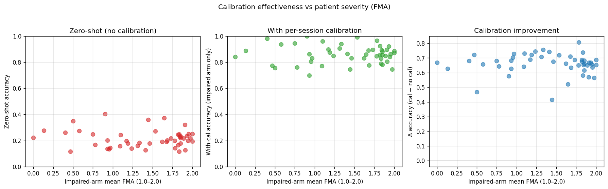

# PhysioMio severity stratification, Stream 2

n = 48 patients · severity = Fugl-Meyer-style 0/1/2 score, aggregated per-patient

## Severity distribution

- Healthy-arm FMA mean (across patients): 1.944 ± 0.092 (range 1.53 - 2.00)
- Impaired-arm FMA mean (across patients): 1.390 ± 0.547 (range 0.00 - 2.00)

## Correlations

| Severity metric | Outcome | n | Spearman ρ [95% CI] | Pearson r | p (Spearman) |
|---|---|---|---|---|---|
| impaired_fma_mean | acc_with_cal | 48 | -0.1093 [-0.3805, +0.1755] | -0.1051 | 0.4597 |
| impaired_fma_mean | acc_with_cal_impaired | 48 | -0.0312 [-0.3279, +0.2675] | -0.0148 | 0.833 |
| impaired_fma_mean | acc_zero_shot | 48 | +0.0123 [-0.2939, +0.3322] | -0.0837 | 0.934 |
| impaired_fma_mean | delta_acc | 48 | -0.1320 [-0.3773, +0.1445] | +0.0005 | 0.371 |
| impaired_worst_session_fma | acc_with_cal_impaired | 48 | -0.0141 [-0.3289, +0.2855] | +0.0232 | 0.9244 |
| healthy_fma_mean | acc_with_cal_healthy | 48 | -0.2420 [-0.5206, +0.0572] | -0.2185 | 0.09754 |

## Severity-stratified accuracy (impaired-arm FMA tertiles)

| Tertile | n | FMA range | Zero-shot acc | With-cal acc | Δ acc |
|---|---|---|---|---|---|
| severe | 16 | 0.00–1.17 | 0.2209 | 0.8787 | +0.6578 |
| moderate | 17 | 1.19–1.82 | 0.2070 | 0.8848 | +0.6778 |
| mild | 15 | 1.83–2.00 | 0.2156 | 0.8612 | +0.6456 |

